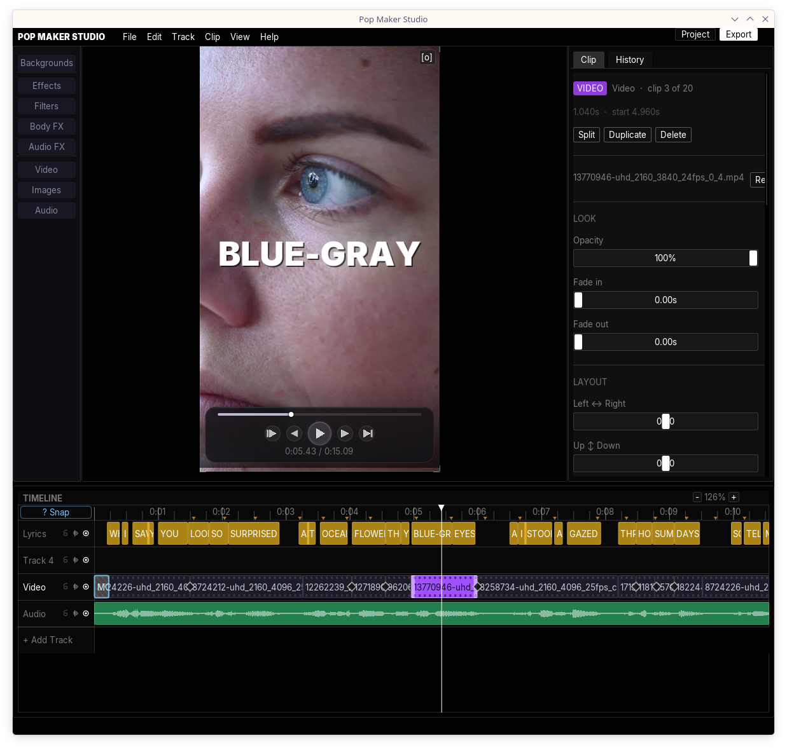
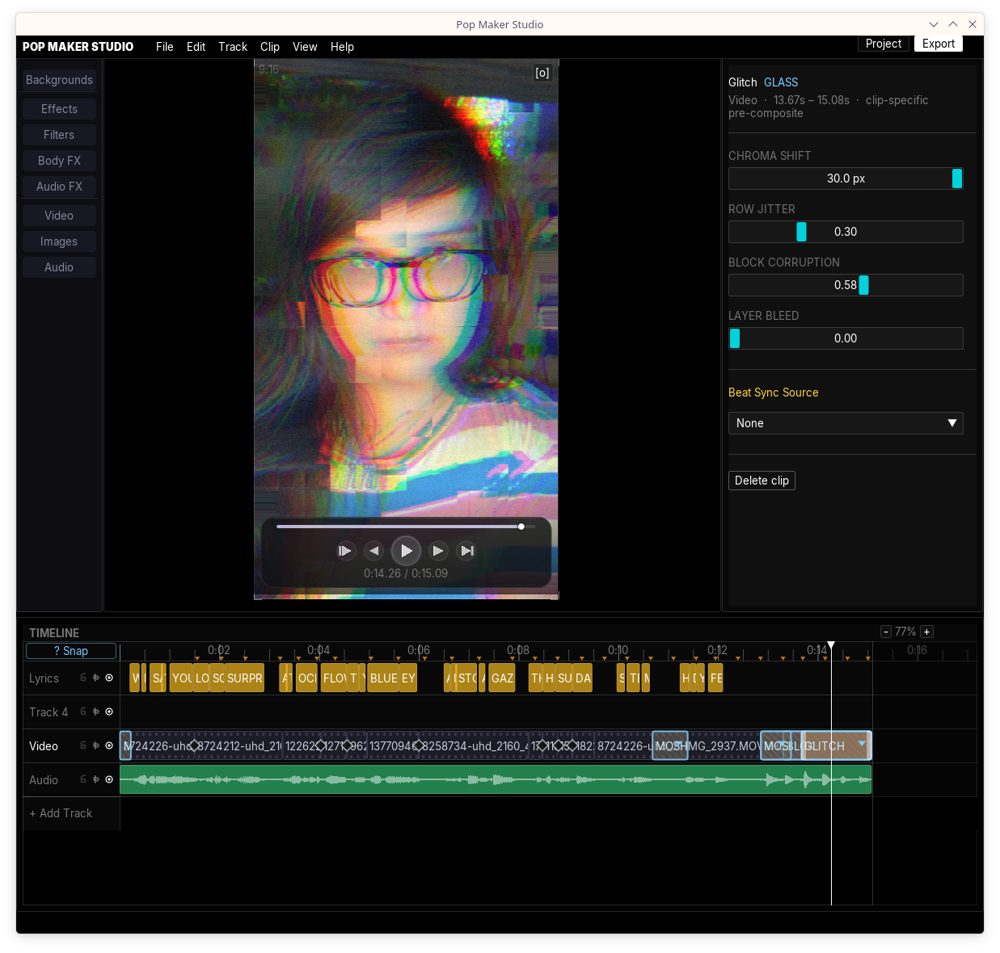
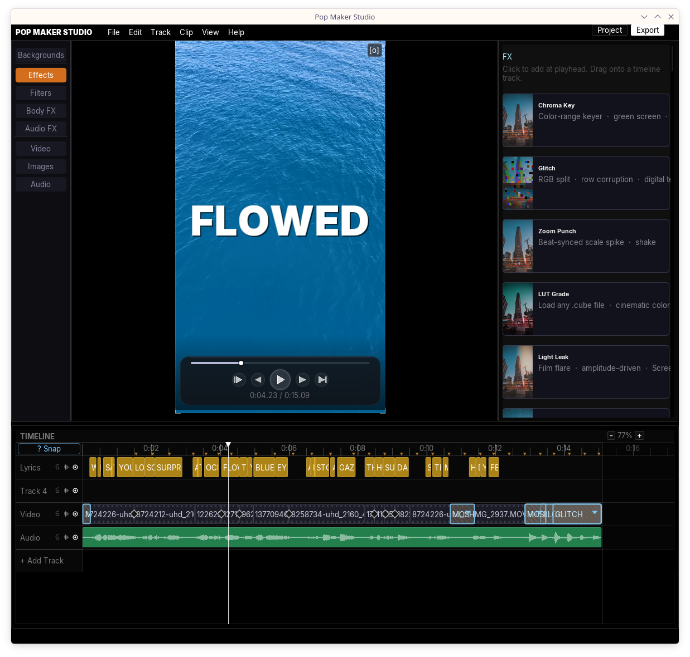
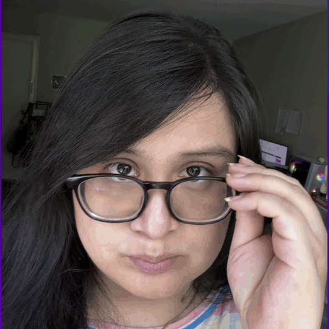
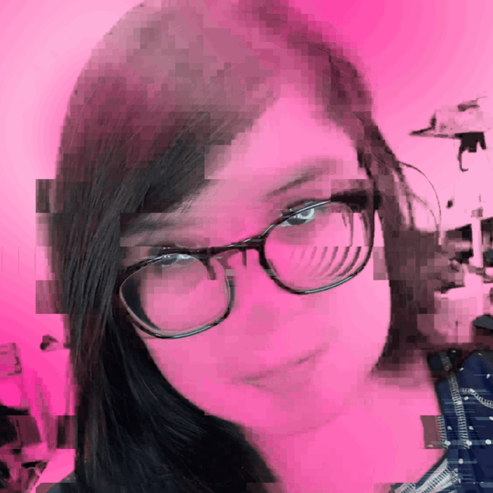
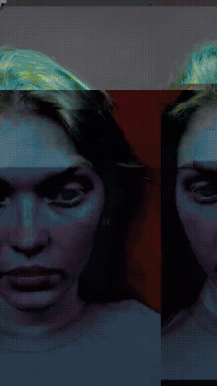

# Pop Maker Studio

  

A native C++ music video and lyric video editor built for pop artists. No subscription. No cloud. No Python runtime. Everything — transcription, vocal separation, voice conversion, background removal, GPU effects — runs entirely on your machine.

---

## What it is

Pop Maker Studio is a non-linear editor purpose-built for the music video workflow: drop your track, get word-level lyrics in seconds, apply visual effects, and render to MP4. It is not a general-purpose editor with music features bolted on. Every decision — the proxy system, the subtitle animation engine, the audio master clock, the glass FX system — was made specifically for this use case.

The application is a single binary with no runtime dependencies beyond what ships with a standard Linux desktop. No Electron. No Python. No Node. No framework. Dear ImGui running on OpenGL, doing exactly what it was designed to do.

---

## ML pipeline

The ML stack runs fully locally. Nothing is uploaded.

**Vocal separation** uses Kim_Vocal_2, a battle-tested MDX-Net model from the UVR5 community (~64 MB). The STFT (FFTW3, n_fft=6144, hop=1024), chunked ONNX inference with 25% frame overlap, iSTFT, and instrumental extraction (`original − vocals`) are implemented in C++ with ONNX Runtime. No Python. No GPU required.

**Transcription** uses whisper.cpp (`large-v3-turbo-q5_0`, ~584 MB) with DTW token timestamps enabled via `WHISPER_AHEADS_LARGE_V3_TURBO`. BPE tokens are grouped into words by detecting leading spaces in the whisper token stream.

**CTC forced alignment** refines Whisper timestamps to frame-accurate precision. A Viterbi CTC decoder (handrolled in C++, two-row DP with full back-pointer matrix) runs wav2vec2-base-960h (Xenova ONNX quantized, ~94 MB) over 30-second chunks to keep the DP matrix at ~750 KB/chunk. Word timestamps are snapped to MJPEG proxy frame boundaries so karaoke highlighting lands on exact video frames.

**Background removal** uses u2net_human_seg via ONNX. Each frame is bilinear-resized to 320×320 for inference, the output mask is bilinear-resized back to the original frame resolution, and a separable Gaussian blur (radius ~1px) smooths mask edges. Masks are streamed as grayscale MJPEG so the canvas updates in real time while the model processes.

**Voice conversion** runs entirely in C++ with zero Python involvement. The pipeline reads PyTorch `.pth` model files directly without libtorch: the zip archive is extracted with the system `unzip`, then a hand-rolled pickle VM parses `data.pkl` to extract tensor metadata and model configuration, and exports a fully functional ONNX graph using a hand-rolled protobuf serializer. The VITS architecture (TextEncoder → ResidualCouplingBlock reverse flow → NSF-HiFiGAN decoder) is reconstructed entirely in C++. HuBERT embeddings use a shared ONNX model. `.pth` in, voice-converted audio out, no Python interpreter ever started.

---

## Effects engine

The GPU effects pipeline runs GLSL fragment shaders on every frame, compositing clip layers into a 9:16 offscreen FBO before piping pixels to ffmpeg.

The **glass FX system** lets effect bricks apply pre-composite to a single clip — before it's blended with the rest of the scene — or post-composite to the entire composited frame, depending purely on track position. No mode switch. No configuration. Drag a Glitch brick above a video clip and it applies to that clip only. Drag it to a separate track and it hits the full frame.

100 effects are defined in a JSON registry and generated at build time: GLSL shader strings, accumulation structs, inspector UI, serialization, project versioning, and MCP tool descriptions — all emitted by a single codegen script (`tools/codegen_effects.py`). Adding a new effect is writing a shader body and a JSON entry.

**Runtime effects** can be dropped into the `effects/` directory as `.json` + `.glsl` pairs and hot-reloaded within one frame — no rebuild required.

---

## Text rendering

Lyric and subtitle clips support per-clip visual styling: shadow (offset, color), stroke (width, color), glow (multi-pass radial bloom, radius, color), and background box (color, padding, corner radius). All layers are rendered in order — glow → background → shadow → stroke → text — via a shared `text_renderer` module used by both the canvas preview and the export renderer, guaranteeing pixel-exact correspondence.

Typography presets wire directly into the text style system: the neon preset enables hot-pink glow; cyberpunk enables cyan stroke.

---

## A/V sync

The playhead is driven by the audio callback position, corrected for output buffer latency:

```
playhead = audio_position() - audio_latency()
```

The audio clock advances unconditionally. The video follows it. This gives lip-sync quality synchronization at any scrub position without polling a wall clock.

---

## Video preview

High-bitrate source footage is transcoded to a per-clip MJPEG proxy at a lower resolution. Scrubbing seeks to the correct proxy frame via a prebuilt seek table — essentially a direct fseek to the right JPEG — which makes real-time preview instant regardless of source codec. Each clip gets its own decoder slot keyed by source file path, so multiple clips sharing the same source get independent decoders with no seek contention.

---

## Subtitle system

Eight animation styles (Fade, Glitch, Typewriter, Bounce, Scale, Slide, Stack, Block) with five grouping modes (Word, Phrase, Line, Segment, Custom N). Font size is stored as a fraction of canvas height, not pixels, so the preview and a 1920×1080 export are geometrically identical.

---

## MCP server

Pop Maker Studio exposes its full editing surface to Claude via the Model Context Protocol. The app runs a Unix socket IPC server on startup; a Python MCP bridge (`mcp_server/server.py`) reads the lock file, connects to the socket, and registers 20 tools covering the complete editing surface: clip creation and manipulation, text style, typography generation, ML pipeline control, effect application, playback, and project persistence.

```bash
pip install -r mcp_server/requirements.txt
python3 mcp_server/server.py
```

See `mcp_server/README.md` for Claude Desktop and Claude Code CLI setup.

---

## Export

Export uses the same OpenGL pipeline as the preview. Every frame rendered to the offscreen FBO is pixel-identical to what the preview showed. Raw RGBA frames are piped to ffmpeg for H.264/AAC encoding. The export path is not a separate renderer — it is the live renderer, pointed at a framebuffer instead of the screen.

**Examples** (9:16 TikTok vertical, rendered in Pop Maker Studio):

<table><tr>
<td valign="top"><br></td>
<td valign="middle"></td>
</tr></table>

---

## Platform

Primary development target is Linux. The GitHub Actions release workflow builds on Ubuntu 22.04, downloads all models (Whisper, Kim_Vocal_2, u2net, HuBERT, wav2vec2, Piper voices), and packages a self-contained tarball.

---

## Building

```bash
cmake -B build -DCMAKE_BUILD_TYPE=Release
cmake --build build -j$(nproc)
```

Dependencies: OpenGL, GLFW, FFmpeg (avcodec/avformat/avutil/swresample/swscale), FreeType, aubio, ONNX Runtime, whisper.cpp, fftw3f.

After modifying `effects/registry.json`, regenerate the codegen headers:

```bash
python3 tools/codegen_effects.py
```
